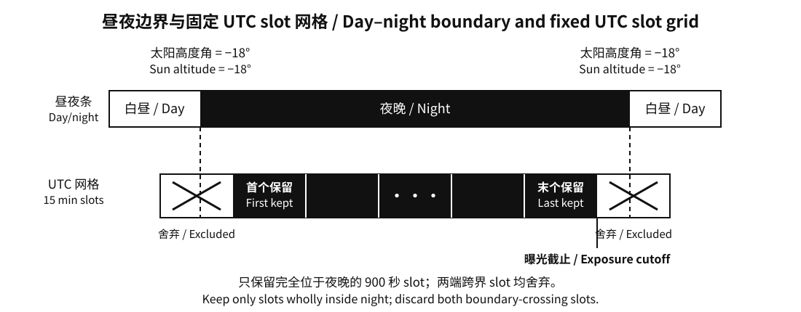
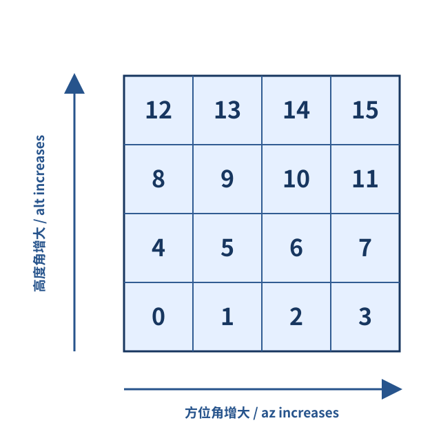

This competition asks participants to submit an agent that autonomously decides an astronomical observing plan. Within a given observing period, the agent simulates operating a spectroscopic survey telescope, choosing the timing, pointing, duration, and observing program of each exposure, along with the mapping between fibres and targets. The agent must allocate its time wisely to maximize the final composite score.

This document describes the competition's task, public scoring rules, and the data structures and interfaces participants need in order to understand the physical model and design strategy; the exact values and interaction protocol are still **governed by the officially published task card**. The footprint area, target count, telescope site, and observing period used here are the current **example configuration** and do not represent an actual competition instance. During the competition, participants cannot access ground-truth weather, the timing of future events, or the random seed used for generation.

## 1. Footprint and Observing Targets

The competition publishes the boundaries of the observing footprint and the target catalog; the agent arranges its actual pointings according to the target distribution. The example footprint used here consists of three disjoint regions with a total area of about $6000\,\mathrm{deg}^2$, containing roughly thirty thousand targets split into five classes: ELG (emission-line galaxy), BGS (bright galaxy), LRG (luminous red galaxy), QSO (quasar), and Star. Each region is a spherical polygon, with adjacent vertices connected by great-circle arcs.

The exact boundaries of the footprint are defined by the public `footprint.csv` file. Each row describes one vertex; the column headers mean:

- `component_id`: the ID of the region the vertex belongs to.
- `vertex_index`: the vertex's sequence number within that region.
- `ra_deg`, `dec_deg`: the vertex's right ascension and declination, both in degrees.

For example, the record `C00,0,335.000000,5.248027` describes vertex 0 of region C00, with right ascension $335^\circ$ and declination $5.248027^\circ$. Vertices within the same region are connected in `vertex_index` order, and the last vertex connects back to the first.


*Figure 1: The example footprint consists of three disjoint regions. Dark blue marks the footprint extent, light-colored dots are ordinary targets, and red circled dots are `required` targets. The image is only an aid for understanding the spatial layout; exact boundaries and target coordinates are given by the public data files.*

Each row of the public `targets.csv` corresponds to one target; the column headers mean:

- `target_id`: the target's unique identifier.
- `ra_deg`, `dec_deg`: the target's celestial right ascension and declination, both in degrees.
- `target_class`: the target class — ELG, BGS, LRG, QSO, or Star.
- `feature_flux`: a relative brightness parameter used for scoring, denoted $f_i$; the larger its value, the easier it is to obtain a valid signal under the same conditions.
- `science_weight`: the target's science weight, denoted $w_i$; it sets the weight applied when the completion factor is converted into a score.
- `required`: whether the target must be prioritized for completion.

The target class is only descriptive of the catalog composition and does not add any score multiplier beyond the public attributes above. The current target catalog does not include a redshift field.

Any `required` target that has not reached the completion threshold described in Section 7 by the end of the observing period incurs an additional penalty; in the current example these targets make up 5% of the total. The agent therefore needs to weigh a target's brightness, science weight, `required` status, and when it is visible in the sky, all together, to make an integrated decision.

The current target-generation rules guarantee that every target has, on at least one night within the observing period, a theoretical observing window at least 900 seconds long. This guarantee only concerns the geometric conditions on Sun and target altitude; it does not guarantee good weather during the window, that a fibre can actually hit the target, or that there is enough time within the observing period to complete all targets. A target's right ascension and declination are **celestial coordinates**; the observing site uses geographic latitude $\phi$ and longitude $\lambda$, which play a different role — the next section explains how they are used to compute a target's position in the sky.

The `targets.csv` and `footprint.csv` files in a local task card carry the same public data as `initialize.payload.targets` and `initialize.payload.footprint` in the formal interaction. The CSV files are convenient for offline inspection and debugging; during a formal run, the agent should treat the content actually received in the `initialize` message as authoritative.

## 2. Nights and the Positions of Targets in the Sky

The catalog's right ascension and declination describe a target's position on the celestial sphere; the telescope's actual pointing instead uses altitude (`alt`) and azimuth (`az`). `alt` is a target's height above the horizon: $0^\circ$ at the horizon, $90^\circ$ at the zenith, and negative below the horizon. `az` is the angle turned along the horizon from north toward east: $0^\circ$ at north, $90^\circ$ at east, $180^\circ$ at south, and $270^\circ$ at west. The `pointing.alt_deg` and `pointing.az_deg` fields in an agent's action are exactly these two pointing angles, in degrees. In the current model, a target's right ascension and declination are fixed, while its altitude (`alt`) and azimuth (`az`), as seen in the site's horizontal coordinate system, change with time. Below, $h_i(t)$ and $A_i(t)$ denote target $i$'s `alt` and `az`, respectively.

The formulas below show how to compute `alt` and `az` at a given time from a target's right ascension and declination. The calculation first uses the UTC time and the site's longitude to find the local sidereal time, then derives the target's hour angle, and finally combines it with the site's latitude to get altitude and azimuth. The example site used in this document is at latitude $24.6157^\circ$ S, longitude $70.3976^\circ$ W. Let the site's geographic latitude be $\phi$ and longitude be $\lambda$. $JD(t)$ is the Julian Date of the UTC time; computed from a UTC Unix timestamp, it is $JD(t)=\operatorname{UnixSeconds}(t)/86400+2440587.5$, where the Unix timestamp is the number of seconds elapsed since 00:00 UTC on 1 January 1970. Using the convention that east longitude is positive for $\lambda$, and letting $d=JD(t)-2451545.0$, the local sidereal time is approximately

$$
\operatorname{LST}(t)=\left[280.46061837+360.98564736629d+\lambda\right]\bmod 360^\circ.\tag{1}
$$

The example site is at longitude $70.3976^\circ$ W, so under the convention that east is positive, $\lambda=-70.3976^\circ$. Substituting into formula (1) gives

$$
\operatorname{LST}(t)=\left[280.46061837+360.98564736629d-70.3976\right]\bmod 360^\circ.
$$

The $t$ in the formula is simply the UTC time given in the message. `utc_offset_hours` is only for understanding the site's local date and time; it should not be used to convert UTC to local time before computing the Julian Date, or the time offset would be applied twice.

> **Note: what is local sidereal time?** You can think of it as the right ascension currently crossing the local north–south meridian. This document expresses sidereal time as an angle, with $360^\circ$ corresponding to 24 hours. For example, if the local sidereal time is $100^\circ$, then the target with right ascension $100^\circ$ is currently crossing the meridian. It differs from ordinary clock time and is mainly used to determine where a target is in the sky at a given moment.

For a target at right ascension $\alpha_i$ and declination $\delta_i$, the hour angle is $H_i(t)=\operatorname{LST}(t)-\alpha_i$; converting the angles to radians for the trigonometric functions, its current altitude $h_i$ satisfies

$$
\sin h_i=\sin\phi\sin\delta_i+\cos\phi\cos\delta_i\cos H_i.\tag{2}
$$

For a target not at the zenith, azimuth $A_i$ can be determined jointly from the two equations below, with the result normalized to $[0^\circ,360^\circ)$:

$$
\begin{align}
\sin A_i&=\frac{-\sin H_i\cos\delta_i}{\cos h_i},\qquad\tag{3}\\
\cos A_i&=\frac{\sin\delta_i-\sin h_i\sin\phi}{\cos h_i\cos\phi}.\tag{4}
\end{align}
$$
Formulas (3) and (4) have no unique solution at the zenith, but in this competition a valid `az` value must still be supplied for a zenith pointing (see Section 8). Formulas (2) through (4) give a target's altitude $h_i$ and azimuth $A_i$, which the agent uses for the `alt` and `az` fields in its pointing command.

This competition defines night as beginning once the Sun's altitude drops to $-18^\circ$, and day as beginning once it rises back above $-18^\circ$. The Sun's altitude is also computed with formula (2), except that the Sun's right ascension and declination change with time. The competition computes the following intermediate angles with an approximate algorithm:

$$
\begin{aligned}
L&=(280.460+0.9856474d)\bmod 360^\circ, &
g&=(357.528+0.9856003d)\bmod 360^\circ,\\
\ell&=(L+1.915\sin g+0.020\sin 2g)\bmod 360^\circ, &
\epsilon&=23.439^\circ-0.0000004^\circ d.
\end{aligned}
$$

From these, `atan2(y, x)` and the inverse trigonometric functions give the Sun's right ascension $\alpha_\odot$ and declination $\delta_\odot$:

$$
\begin{align}
\alpha_\odot&=\operatorname{atan2}(\cos\epsilon\sin\ell,\cos\ell)\bmod 360^\circ,\qquad\tag{5}\\
\delta_\odot&=\arcsin(\sin\epsilon\sin\ell).\tag{6}
\end{align}
$$

> **Note: what is `atan2(y, x)`?** It is the two-argument arctangent function provided by the math library of most programming languages; it uses the signs of both $x$ and $y$ to determine which quadrant the angle is in. Unlike computing $\arctan(y/x)$ alone, it does not lose quadrant information and correctly handles the case $x=0$.

Finally, substituting the Sun's right ascension and declination into formula (2) gives the Sun's altitude as seen from the example site at a given UTC time:

$$
h_\odot(t)=\arcsin\!\left[\sin\phi\sin\delta_\odot+
\cos\phi\cos\delta_\odot\cos\bigl(\operatorname{LST}(t)-\alpha_\odot\bigr)\right].\tag{7}
$$

The Moon's position is first estimated in ecliptic coordinates. With $d=JD(t)-2451545.0$ as before, define the Moon's mean ecliptic longitude $L_M$, mean anomaly $M_M$, and the latitude argument $F_M$:

$$
\begin{aligned}
L_M&=(218.316+13.176396d)\bmod 360^\circ,\\
M_M&=(134.963+13.064993d)\bmod 360^\circ,\\
F_M&=(93.272+13.229350d)\bmod 360^\circ.
\end{aligned}\tag{8}
$$

From these, the Moon's ecliptic longitude $\lambda_M$ and ecliptic latitude $\beta_M$ are approximated as:

$$
\lambda_M=L_M+6.289^\circ\sin M_M,\qquad
\beta_M=5.128^\circ\sin F_M.\tag{9}
$$

Using the obliquity of the ecliptic $\epsilon$ from the Sun-position calculation above, first compute the Moon's unit direction components in equatorial coordinates:

$$
\begin{aligned}
x_M&=\cos\lambda_M\cos\beta_M,\\
y_M&=\sin\lambda_M\cos\beta_M\cos\epsilon-\sin\beta_M\sin\epsilon,\\
z_M&=\sin\lambda_M\cos\beta_M\sin\epsilon+\sin\beta_M\cos\epsilon,
\end{aligned}\tag{10}
$$

which give the Moon's right ascension $\alpha_M$ and declination $\delta_M$:

$$
\alpha_M=\operatorname{atan2}(y_M,x_M)\bmod 360^\circ,\qquad
\delta_M=\arcsin z_M.\tag{11}
$$

Substituting $\alpha_M$ and $\delta_M$ into formula (2) gives the Moon's altitude $h_M(t)$ at the example site. For any two points $(\alpha_1,\delta_1)$ and $(\alpha_2,\delta_2)$, the current model uses the spherical angular separation

$$
\Theta=\arccos\!\left[\sin\delta_1\sin\delta_2+
\cos\delta_1\cos\delta_2\cos(\alpha_1-\alpha_2)\right].\tag{12}
$$

Substituting the Sun's and Moon's right ascension and declination into formula (12) gives the Sun–Moon angular separation $\psi(t)$, and the Moon's illuminated fraction is taken as

$$
I_M(t)=\frac{1-\cos\psi(t)}{2}.\tag{13}
$$

Substituting the right ascension and declination of the Moon and target $i$ into formula (12) gives the Moon–target angular separation (lunar separation) $\rho_i(t)$. Let the maximum lunar penalty, the Moon-altitude exponent, and the angular-decay scale in `scoring.lunar_model` be denoted $P_M$, $\gamma_M$, and $\theta_M$; the current example takes $P_M=0.75$, $\gamma_M=1$, $\theta_M=35^\circ$. The Moon's quality factor for this target is

$$
L_i(t)=1-P_M I_M(t)
\sin\!\bigl(\max(0,h_M(t))\bigr)^{\gamma_M}
\exp\!\left(-\frac{\rho_i(t)}{\theta_M}\right).\tag{14}
$$

When the Moon is below the horizon, $L_i=1$; the brighter the Moon, the higher it is, and the closer it is to the target, the smaller $L_i$ becomes, and the stronger its reduction of observing quality. Moonlight is computed per target during scoring, and is not pre-applied as a blanket deduction written into `sky_quality`. All angles above are expressed in degrees. This set of lunar-position formulas is a low-precision approximation used by the competition, not a high-precision astronomical ephemeris; participants reproducing the competition's calculations should follow the definitions given here.



*Figure 2: The black-and-white bar on top shows day and night, bounded by a Sun altitude of $-18^\circ$; below it is the grid of 900-second slots aligned to UTC quarter-hours. Slots marked with an X at either end straddle the day–night boundary and are therefore excluded from observing; an exposure ends no later than the end of the last retained slot. The number of slots shown is only illustrative.*

To make weather modeling tractable, the competition uses a fixed grid of 900-second slots aligned to UTC quarter-hours (e.g. UTC 08:00, 21:15, 15:30, 03:45), with weather parameters updated once per slot. Night is bounded by the moments when the Sun's altitude drops to and rises back to $-18^\circ$. The first retained slot begins at the earliest grid point no earlier than dusk, and the last retained slot ends at the latest grid point no later than dawn. In the figure, both boundaries fall inside a slot, so both of those boundary-straddling slots are discarded; if a boundary happens to coincide exactly with a grid point, there is no straddling slot on that side. Each night's exposures stop at the end of the last retained slot. Participants need to plan their exposures accordingly.

Another quantity related to a target's position is airmass, which represents the thickness of atmosphere the light passes through. In general, the closer a target is to the horizon, the more atmosphere its light must traverse. Scoring uses an airmass $X(h)$ that varies with altitude and is normalized at the zenith. Letting the zenith distance be $z=90^\circ-h$, the competition defines

$$
X(h)=\frac{\left[\cos z+0.50572(96.07995-z)^{-1.6364}\right]^{-1}}
{\left[1+0.50572(96.07995)^{-1.6364}\right]^{-1}}.\tag{15}
$$

In the formula, $z$ is in degrees. The closer a target is to the horizon, the larger its airmass and the stronger its negative effect on observing quality, which is why observing programs typically set a minimum target altitude. The competition sets the minimum observing altitude for targets to $30^\circ$ (see Section 3).

## 3. Exposures and Fibre Mapping: How One Pointing Covers Targets

Each `observe` command the agent issues counts as one exposure. An exposure may span ordinary slot boundaries within the same night, but it cannot span two nights. If the last slot of the night runs out before the exposure the command requested has finished, the exposure is terminated at the end of that slot, and observing quality and score are computed from the actual exposure duration. The agent decides the duration of each exposure itself. For simulation reasons, the competition requires the declared duration of a single exposure to be an integer number of seconds in the closed interval $[60,3600]$ — both 60 and 3600 seconds are valid declarations; the actual duration, if truncated because the night's slots ran out, can be shorter than 60 seconds. Because of the effect of airmass, the competition only scores a target if its altitude stays at or above $30^\circ$ for the entire exposure.


*Figure 3: The $4\times4$ grid of fibre-assignable cells for one pointing. The blue cells are contiguous; white dots are targets that fall within the field of view, and red circles are targets correctly assigned and hit. Each cell corresponds to at most one target per exposure; this figure only illustrates target positions and assignment outcomes.*

A spectroscopic survey telescope typically collects light from targets through fibres and feeds it to the spectrograph. In each exposure, the agent must submit an altitude/azimuth pointing and assign the targets it wants to observe to specific fibres. The current example abstracts the field of view as a $4\times4$ grid of adjacent assignable cells, each cell corresponding to one fibre, with at most one target assigned per cell per exposure. Each cell has an area of $0.4\,\mathrm{deg}^2$ and side length $a=\sqrt{0.4}\approx0.632^\circ$; there are no gaps between cells. The field of view has a side length of $4a\approx2.530^\circ$ and a total area of $16\times0.4=6.4\,\mathrm{deg}^2$.

Fibre IDs are determined by the local tangent plane near the pointing. Define "up" in the diagram as the direction of **increasing altitude** and "right" as the direction of **increasing azimuth**; row index $r$ increases from bottom to top and column index $c$ increases from left to right, both ranging from 0 to 3. The ID is $4r+c$, and a cell's center is offset along these two directions by $(r-1.5)a$ and $(c-1.5)a$ respectively. So cell 0 is at the bottom-left, 3 is at the bottom-right, 12 is at the top-left, and 15 is at the top-right. Here, "up, down, left, right" are local coordinate directions defined relative to the telescope's pointing — not fixed east/west/north/south on a map, nor fixed directions of increasing/decreasing right ascension and declination. The field-of-view orientation is fixed at the exposure's start by the pointing's azimuth. Even if a single cell contains multiple targets, one exposure can only assign one of them to that fibre.



*Figure 4: The 16 fibres are numbered on a $4\times4$ grid: row index $r$ from bottom to top and column index $c$ from left to right, both starting at 0, with ID $4r+c$. The arrows show the local directions of increasing altitude and azimuth at the pointing, not fixed geographic directions.*

At the start of an exposure, the competition backend projects the sky onto a local tangent plane centered on the **actual pointing**, and determines where each assigned target falls. The tangent plane uses a gnomonic projection: if $\mathbf u_i$ is the target's unit direction vector, $\mathbf c$ is the field-of-view center direction, and $\mathbf t_{\mathrm{az}}$ and $\mathbf t_{\mathrm{alt}}$ are the unit vectors at the center pointing toward increasing azimuth and altitude respectively, then the plane coordinates are

$$
x_i=\frac{\mathbf u_i\cdot\mathbf t_{\mathrm{az}}}{\mathbf u_i\cdot\mathbf c}\frac{180}{\pi},\qquad
y_i=\frac{\mathbf u_i\cdot\mathbf t_{\mathrm{alt}}}{\mathbf u_i\cdot\mathbf c}\frac{180}{\pi}.\tag{16}
$$

A target whose denominator is not positive lies outside the tangent plane's visible hemisphere. The actual pointing may deviate from the commanded pointing; in that case, the backend computes the projection from the deviated center. A target only counts as a hit if it falls **within the assignable cell of the fibre it is assigned to**; falling in another cell or outside the field of view scores nothing. The shared boundary between adjacent cells belongs to exactly one of the two cells, determined by the backend's row/column partitioning rule — so avoid observing targets that fall exactly on a shared boundary; the outer boundary of the field of view belongs to the outermost cells. A target that falls within a cell but is assigned to a different fibre also scores nothing; an unassigned target scores nothing even if it lies within the field of view. The same target cannot be assigned to more than one fibre at once, so a single exposure can hit at most 16 targets. The current model assumes the telescope performs sidereal tracking after a hit is registered, so a target's position relative to its cell does not change during the exposure; a hit is therefore determined only at the start of the exposure, while the minimum-altitude requirement must still hold for the entire exposure. A miss incurs no additional penalty, but the time already spent is not refunded.

## 4. Moon, Weather, and Event Messages

The quality of an astronomical exposure is affected by both atmospheric and instrument conditions. `seeing` describes the blurring of images caused by the atmosphere — the smaller, the better; `transparency` (atmospheric transmission) — the higher, the better; `sky_quality` is the sky-condition quality factor used by the competition — the higher, the better. `instrument_efficiency` is the efficiency parameter of the entire acquisition chain — the higher, the better. These numeric weather quantities and their future ground truth are never sent directly to the agent. The organizers publish coarse-grained bulletins per observing slot and periodically provide descriptive forecasts; event entries in both kinds of messages give an event category and a rough direction, and forecasts additionally list the observing nights expected to be affected. Direction uses N, NE, E, SE, S, SW, W, NW, or ALL for the whole sky.

The first protocol message the agent receives after startup is `initialize`, which requires no reply. Below is an example message. To make the structure easier to read, the nights, footprint, and targets arrays each show only one entry, and `scoring` shows only a subset of fields; the actual message contains the complete public data and scoring configuration.

```json
{
  "protocol_version": "participant-agent-protocol-v4",
  "message_type": "initialize",
  "payload": {
    "schema_version": "v4-initialize-v1",
    "task_card": {"card_id": "demo", "scenario_slug": "v4-demo", "phase": "local"},
    "site": {
      "name": "Paranal, Chile (virtual)",
      "latitude_deg": -24.6157,
      "longitude_deg": -70.3976,
      "utc_offset_hours": -4.0,
      "sun_altitude_limit_deg": -18.0,
      "minimum_altitude_deg": 30.0
    },
    "survey": {
      "start_utc": "2026-10-02T00:00:00Z",
      "end_utc": "2026-10-08T08:45:00Z",
      "slot_seconds": 900,
      "nights": [{
        "night_id": "N20261001",
        "night_date": "2026-10-01",
        "observing_start_utc": "2026-10-02T00:00:00Z",
        "observing_end_utc": "2026-10-02T09:00:00Z",
        "slot_count": 36
      }]
    },
    "instrument": {
      "n_fibers": 16,
      "grid_side": 4,
      "fiber_area_deg2": 0.4,
      "gap_deg": 0.0,
      "glass_side_deg": 0.632456,
      "pitch_deg": 0.632456,
      "fov_side_deg": 2.529822,
      "layout": "row-major, fiber 0 bottom-left; rows along +alt, columns along +az at exposure start; gnomonic plane centred on the actual pointing",
      "exposure": {"min_duration_seconds": 60, "max_duration_seconds": 3600}
    },
    "scoring": {"schema_version": "v4-score-v1", "q0": 0.68, "flux_zero_point": 0.5,
                "reporting": {"correct_reward": 100, "false_penalty": -150,
                              "false_report_free_allowance": 2, "max_consecutive_reports": 32}},
    "footprint": [{
      "component_id": "C00",
      "vertices": [[335.0, -5.2], [339.3, -6.3], [337.2, -3.8]]
    }],
    "targets": {
      "columns": ["target_id", "ra_deg", "dec_deg", "target_class", "feature_flux", "science_weight", "required"],
      "rows": [["V4T000001", 337.0, -5.0, "BGS", 1.48, 0.45, false]]
    },
    "limits": {
      "global_wallclock_seconds": 900,
      "max_consecutive_reports": 32,
      "response_max_bytes": 524288,
      "decision_timeout": "global only (no per-decision timeout)"
    }
  }
}
```

The meaning of each group of fields in `initialize` is as follows:

- `protocol_version`, `message_type`, and `payload.schema_version`: identify the competition backend version, the initialization message type, and the structure version of the initialization data, respectively.
- `task_card`: gives the identifier and public phase information for this task card.
- `site`: gives the site's name, latitude and longitude, and the altitude limits used for the Sun and for targets; these parameters are used to compute the positions of the Sun, Moon, and targets in the sky.
- `survey`: gives the start and end times of the observing period, the duration of each slot, and the calendar of observing nights. Within `survey.nights`, `night_date` is that night's identifying date, which is not necessarily the UTC date of its first slot; `slot_seconds` is 900 in the current version.
- `instrument`: gives the field-of-view, fibre, and exposure parameters described in Section 3.
- `scoring`: gives the complete public scoring configuration used below. `reporting.false_report_free_allowance` is the number of false reports exempted from penalty after each correct report; the example value 2 means that, before the next correct report, the first two false reports incur no penalty, and every false report from the third onward deducts 150 points. `reporting.max_consecutive_reports` is the cap on consecutive `report` submissions, with an example value of 32.
- `footprint`: describes the observing extent via each region's `component_id` and its right-ascension/declination vertex list `vertices`.
- `targets`: declares the target table's column names in `columns`, with each row in `rows` holding values in the same order.
- `limits`: gives the limits on the agent's runtime and responses.
    - `global_wallclock_seconds`: the wall-clock time budget for the entire task card; 900 seconds in the example.
    - `max_consecutive_reports`: the cap on consecutive `report` submissions, identical to `scoring.reporting.max_consecutive_reports`. Submitting another `report` after reaching the cap terminates the task card; that over-limit action is not settled. The counter resets to zero after a `wait` or `observe`; a correct report still counts as one `report`.
    - `response_max_bytes`: the size cap for the agent's entire `decision_response` JSON line, including both protocol fields and action parameters; measured in UTF-8 encoded bytes, excluding the trailing newline. The example value 524288 bytes is 512 KiB.
    - `decision_timeout`: the decision time-limit rule. Currently there is only the global runtime limit above; there is no separate time limit for an individual decision.

The initialization message contains no future weather ground truth and lists no future events.

Whenever the agent needs to make a decision, the system sends a `decision_request`. The first such request immediately follows the `initialize` message. The example below shows that first request: the opening bulletin and the first forecast appear both in `new_messages` and, separately, in `latest_bulletin` and `latest_forecast`; there is no previous-action result yet at this point. The forecast and event in the example are only for illustrating the format.

```json
{
  "protocol_version": "participant-agent-protocol-v4",
  "message_type": "decision_request",
  "decision_sequence": 1,
  "payload": {
    "schema_version": "v4-decision-snapshot-v1",
    "now_utc": "2026-10-02T00:00:00Z",
    "survey_end_utc": "2026-10-08T08:45:00Z",
    "observe_action_index": 0,
    "running_total": 0.0,
    "wallclock": {"elapsed_seconds": 0.047, "remaining_seconds": 899.953},
    "latest_bulletin": {
      "record_type": "bulletin",
      "slot_id": "N20261001-S001",
      "night_id": "N20261001",
      "issued_at_utc": "2026-10-02T00:00:00Z",
      "initial": true,
      "notices": [{"event_kind": "terrain_obstruction", "direction": "NE"}]
    },
    "latest_forecast": {
      "record_type": "forecast",
      "issued_at_utc": "2026-10-02T00:00:00Z",
      "coverage_start_utc": "2026-10-02T00:00:00Z",
      "coverage_end_utc": "2026-10-09T00:00:00Z",
      "notices": [{"event_kind": "overcast", "direction": "SW", "nights": ["2026-10-02"]}]
    },
    "active_requests": [],
    "new_messages": [
      {
        "record_type": "bulletin",
        "slot_id": "N20261001-S001",
        "night_id": "N20261001",
        "issued_at_utc": "2026-10-02T00:00:00Z",
        "initial": true,
        "notices": [{"event_kind": "terrain_obstruction", "direction": "NE"}]
      },
      {
        "record_type": "forecast",
        "issued_at_utc": "2026-10-02T00:00:00Z",
        "coverage_start_utc": "2026-10-02T00:00:00Z",
        "coverage_end_utc": "2026-10-09T00:00:00Z",
        "notices": [{"event_kind": "overcast", "direction": "SW", "nights": ["2026-10-02"]}]
      }
    ],
    "last_result": null
  }
}
```

The meaning of each field is as follows:

- `protocol_version` and `message_type`: identify the communication protocol and declare that this is a decision request.
- `decision_sequence`: this decision's sequence number, which the agent must echo back unchanged in its response.
- `payload.schema_version`: the structure version of the decision snapshot; `v4-decision-snapshot-v1` in the current example.
- `now_utc` and `survey_end_utc`: the current simulated time and the end time of the observing period, both in UTC. The example runs one week of observing (October 1 to 8).
- `observe_action_index`: the number of `observe` actions executed so far.
- `running_total`: the sum of each target's best score so far; it excludes the `required` penalty, the uniformity penalty, observation-request rewards, and `report` rewards/penalties, so it is not equal to the final score if the run stopped at this instant.
- `wallclock`: the agent's elapsed and remaining wall-clock runtime.
- `latest_bulletin` and `latest_forecast`: the most recently issued bulletin and the weather/event forecast as of the current moment.
- `active_requests`: currently issued, not-yet-expired observation requests and their real-time progress; an empty array when there are no active requests.
- `new_messages`: the complete message objects newly delivered since the last decision request, including bulletins, weather/event forecasts, observation requests, and, when applicable, request settlements, report results, or state resynchronizations. If one action spans multiple issuance times, these messages all arrive together in the next request.
- `last_result`: the outcome of the previous action; empty for the first decision.

If the previous action was an observation, `last_result` in the next request may look like:

```json
{
  "last_result": {
    "action": "observe",
    "observe_index": 0,
    "assigned_count": 3,
    "hit_count": 2,
    "hits": [
      {"target_id": "V4T000001", "score": 0.4321},
      {"target_id": "V4T000002", "score": 0.3125}
    ]
  }
}
```

`assigned_count` is the number of targets assigned in the previous action, and `hit_count` is how many of those passed both the fibre hit test and the minimum-altitude check; `hits` lists only these targets and their score for this exposure, without returning fibre IDs. A hit target can still score 0 if weather or an event closed it. An assigned target that does not appear in `hits` either did not hit its assigned fibre or did not meet the minimum-altitude requirement for the whole exposure. The example above assumes the third assigned target failed one of these conditions. If the previous action was `wait`, `last_result` is `{"action": "wait"}`; if it was `report`, it includes whether the report was correct, whether a fault was repaired, and the resulting reward or penalty — see Section 4.

Bulletins, weather and event forecasts, and report results and state resynchronizations are all delivered through `new_messages`, not as separate top-level protocol messages.

Weather and event forecasts are issued starting from the first night of the observing period, once every 7 calendar days, at the start of observing on the corresponding night; "weekly" here means a seven-day cadence anchored to the first night, not fixed to any particular day of the week. Each forecast covers the 7 days starting from its issuance time. The first request shown earlier already illustrated the first forecast; below, another example task card spanning two weeks shows where a weekly forecast sits within a `decision_request`. The same new forecast appears in both `latest_forecast` and `new_messages`. The bulletin for that night's first slot is also in this request. The example keeps only one forecast `notice`; in practice, `notices` can be empty or contain several entries. To avoid repetition, the other `payload` fields and the two `latest_...` objects are described with comments — the code block below is a structural illustration, not a complete, directly parseable JSON message.

```jsonc
{
  "protocol_version": "participant-agent-protocol-v4",
  "message_type": "decision_request",
  "decision_sequence": 17,
  "payload": {
    // schema_version, now_utc, survey_end_utc, observe_action_index,
    // running_total, and wallclock omitted.
    // "latest_bulletin": same as new_messages[0],
    // "latest_forecast": same as new_messages[1],
    "new_messages": [
      {
        "record_type": "bulletin", "slot_id": "N20261008-S001", "night_id": "N20261008",
        "issued_at_utc": "2026-10-09T00:00:00Z", "initial": false,
        "notices": []
      },
      {
        "record_type": "forecast", "issued_at_utc": "2026-10-09T00:00:00Z",
        "coverage_start_utc": "2026-10-09T00:00:00Z",
        "coverage_end_utc": "2026-10-16T00:00:00Z",
        "notices": [{"event_kind": "overcast", "direction": "SW", "nights": ["2026-10-09"]}]
      }
    ],
    "last_result": {"action": "wait"}
  }
}
```

If a later request has no new forecast, `new_messages` contains no `forecast` object, and `latest_forecast` continues to hold the most recently issued forecast.

The forecasts in the current protocol do not define a separate hit rate, miss rate, or false-alarm rate: any event included in a forecast is guaranteed to intersect the observing window on the listed nights. The forecast's uncertainty comes from its granularity — it discloses only the event category, a rough direction, and the affected nights, not the exact start/end times, spatial boundaries, or intensity. If a future task card introduces probabilistic forecasts, that must be announced separately through new public fields or a new protocol version.

The meaning of the fields in a forecast object and its `notices` is as follows:

- `issued_at_utc`: the actual issuance time of this forecast.
- `coverage_start_utc`, `coverage_end_utc`: the time range this forecast covers.
- `event_kind`: the event category each `notice` expects to occur.
- `direction`: the event's rough direction. `ALL` means the whole sky; `N`, `NE`, `E`, `SE`, `S`, `SW`, `W`, `NW` indicate a rough bearing, without specifying sector boundaries or the affected altitude range.
- `nights`: an array of dates for the observing nights expected to be affected, matching `survey.nights[].night_date`. It indicates the event intersects the observing window on these nights, without giving the event's exact start or end time.

A forecast for a given night does not substitute for that night's per-slot bulletins.

All five weather-event categories use the same `notice` structure above, varying only `event_kind`, `direction`, and `nights`. The entries below are **format examples, not an actual forecast from any task card**:

```json
[
  {"event_kind": "rain", "direction": "ALL", "nights": ["2026-10-01"]},
  {"event_kind": "overcast", "direction": "SW", "nights": ["2026-10-02"]},
  {"event_kind": "haze", "direction": "NW", "nights": ["2026-10-03", "2026-10-04"]},
  {"event_kind": "cold_snap", "direction": "ALL", "nights": ["2026-10-05"]},
  {"event_kind": "storm", "direction": "ALL", "nights": ["2026-10-06"]}
]
```

`rain` is rainfall and `storm` is a severe windstorm; within the affected part of the sky, they can temporarily close observing. `overcast` means cloud cover and `haze` means haze; both may lower transparency or `sky_quality` and increase `seeing`, and either can affect the whole sky or a particular direction sector. `cold_snap` represents a cold snap, which the current model mainly treats as an event that degrades observing quality across the whole sky. Forecasts do not provide numeric values for `seeing`, `transparency`, or `sky_quality`, nor do they give event intensity. A weather event's duration is counted in **observable slots**, carrying over into the next observing night if it runs into daytime; the `nights` field in a forecast is still only night-grained and cannot be used to infer how many slots the event lasts.

Each night's first real-time message is the `bulletin` for that night's first slot, which publishes information relevant to that slot. Every subsequent slot also publishes a bulletin with the same structure. The two records below illustrate, respectively, the observing period's opening bulletin and the first bulletin of a later night:

```jsonl
{"record_type":"bulletin","slot_id":"N20261001-S001","night_id":"N20261001","issued_at_utc":"2026-10-02T00:00:00Z","initial":true,"notices":[{"event_kind":"terrain_obstruction","direction":"NE"}]}
{"record_type":"bulletin","slot_id":"N20261002-S001","night_id":"N20261002","issued_at_utc":"2026-10-03T00:00:00Z","initial":false,"notices":[{"event_kind":"overcast","direction":"ALL"}]}
```

The fields and issuance rules of a bulletin are as follows:

- `record_type`: always `bulletin`, indicating this is a real-time bulletin.
- `slot_id`: the identifier of the slot this bulletin corresponds to.
- `night_id`: the identifier of the observing night this bulletin belongs to.
- `issued_at_utc`: the bulletin's issuance time, i.e. the start of that slot.
- `notices`: lists the disclosable events relevant to that slot; each entry has only `event_kind` and `direction`, without the `nights` field used in forecasts. An empty array only means this slot has no event to disclose — it does not guarantee good weather quality or a healthy instrument.
- `initial`: `true` only for the very first slot bulletin of the whole observing period; if there is any terrain obstruction near the telescope, its rough direction is disclosed here and not again in any other slot. It is `false` for all subsequent nights.

Besides announced events, the weather model can also produce background closures with no accompanying `notice`. So even when `notices` is empty, that slot may still be entirely unobservable; instrument faults are likewise never disclosed through ordinary bulletins. The agent can only infer these hidden states from its exposure feedback.

At the start of the first night, the first `decision_request`'s `new_messages` contains both the opening bulletin and the first forecast; the corresponding `latest_bulletin` and `latest_forecast` are populated with these two records as well.

Besides the five weather categories, public messages can also include rocket launches, earthquakes, and terrain obstructions. These follow the same `forecast` or `bulletin` record formats described above and are delivered through `decision_request.payload.new_messages`. Some task cards additionally enable special stress scenarios; see the appendix for the specific state-resynchronization messages and pointing offsets, with the officially published task card as the final authority.

The three records below illustrate, respectively, an advance forecast of a rocket launch, the real-time bulletin while it is occurring, and the real-time bulletin after an earthquake; they occur at different times and are not all part of the same request's `new_messages`.

Example forecast for a rocket launch:

```json
{
  "record_type": "forecast",
  "issued_at_utc": "2026-10-02T00:00:00Z",
  "coverage_start_utc": "2026-10-02T00:00:00Z",
  "coverage_end_utc": "2026-10-09T00:00:00Z",
  "notices": [{"event_kind": "rocket_launch", "direction": "NE", "nights": ["2026-10-03"]}]
}
```

Example real-time bulletin during a rocket launch:

```json
{
  "record_type": "bulletin",
  "slot_id": "N20261003-S028",
  "night_id": "N20261003",
  "issued_at_utc": "2026-10-04T06:45:00Z",
  "initial": false,
  "notices": [{"event_kind": "rocket_launch", "direction": "NE"}]
}
```

Example real-time bulletin after an earthquake:

```json
{
  "record_type": "bulletin",
  "slot_id": "N20261004-S010",
  "night_id": "N20261004",
  "issued_at_utc": "2026-10-05T02:15:00Z",
  "initial": false,
  "notices": [{"event_kind": "earthquake", "direction": "ALL"}]
}
```

The disclosure method and effect of each event type are as follows:

- `rocket_launch`: an expected or ongoing rocket launch. Internally, the backend generates a hidden horizontal-coordinate sector with an azimuth boundary and an altitude ceiling, and checks closures target by target and time-segment by time-segment during the event. Labels like `NW` in a bulletin are derived only from the hidden sector's central bearing and do not represent the whole corresponding $45^\circ$ azimuth range; the hidden sector may also extend into an adjacent rough direction. The forecast gives only the affected observing nights and a rough direction, not the exact start/end times or spatial boundaries; once the event starts, the bulletins for slots overlapping its duration include a matching entry. A rocket event ends no later than the end of the last slot of the night it starts in; any unused scheduled duration does not carry over to the next night.
- `earthquake`: never appears in a forecast, only in a bulletin after it occurs. It mainly affects instrument efficiency, with the effect weakening night by night to simulate the repair process. Subsequent affected observing nights may still show an earthquake bulletin, which does not necessarily mean another earthquake has occurred.
- `terrain_obstruction`: disclosed only once, in the opening bulletin shown above, indicating a low-altitude obstruction that persists for the entire observing period; the obstructed region cannot be observed.

None of the messages above give an event's exact spatial boundary, intensity, or numeric multiplier; the agent can combine the public messages, its own computed celestial positions, and post-exposure hit and score feedback to judge the actual conditions.

Some task cards issue time-limited observation requests while running. A request only references targets already public at initialization; it never adds new celestial objects on the fly. A future request does not appear in the initialization message or any decision snapshot before its issuance time; once `issued_at_utc` is reached, the request is published as an `observation_request` in `new_messages`:

```json
{
  "schema_version": "v4-observation-request-v1",
  "record_type": "observation_request",
  "request_id": "V4RQ0001",
  "issued_at_utc": "2026-10-05T00:00:00Z",
  "deadline_utc": "2026-10-06T08:45:00Z",
  "target_ids": ["V4T000160", "V4T002330", "V4T000311", "V4T001021"],
  "minimum_completed": 3,
  "completion_factor_threshold": 0.5,
  "completion_reward": 100.0,
  "reason": "time-critical follow-up"
}
```

- `request_id`: the request's identifier, used only for tracking messages and results; the `observe` action does not need, and must not include, this field.
- `issued_at_utc`, `deadline_utc`: the request's start and end times. Only valid exposures that fall entirely within $[\mathrm{issued\_at},\mathrm{deadline}]$ count toward the request.
- `target_ids`: the existing targets involved in this request.
- `minimum_completed`: the minimum number of distinct targets that must be completed to earn the reward.
- `completion_factor_threshold`: the per-target completion-factor threshold, judged using $g_{i,e}$ from Section 5, not the final contribution that includes the program multiplier.
- `completion_reward`: the one-time score awarded once the minimum completion count is reached.
- `reason`: a short public description of the request.

The backend automatically attributes valid exposures within the time window to every request they apply to; the same exposure still earns science score under the normal rules and can simultaneously advance overlapping requests. Each target only needs one exposure that meets the threshold — multiple sub-threshold exposures of the same target do not add up. An unmet request incurs no penalty.

While a request is active, `active_requests` repeats the fields above and adds `completed_target_ids`, `completed_count`, and `remaining_count`. Once the deadline is reached, the request is removed from `active_requests` and its result is sent in `new_messages`:

```json
{
  "schema_version": "v4-observation-request-result-v1",
  "record_type": "observation_request_result",
  "issued_at_utc": "2026-10-06T08:45:00Z",
  "request_id": "V4RQ0001",
  "status": "completed",
  "completed_target_ids": ["V4T000160", "V4T002330", "V4T000311"],
  "completed_count": 3,
  "minimum_completed": 3,
  "score_delta": 100.0,
  "revised": false
}
```

`status` is `completed` or `expired`. If a Hard-mode `data_loss` later invalidates exposures within the request's time window, the backend recomputes progress from the valid ledger; if an already-published result changes as a result, another result with `revised: true` is sent, and the reward is revoked or restored accordingly.

Instrument-fault events reduce `instrument_efficiency` but never appear directly in bulletins or forecasts. The agent can judge, from its observing scores, whether to submit a `report`. If an unrepaired instrument fault genuinely exists at the time of submission, the backend repairs it immediately and awards 100 points at final settlement. A premature, incorrect, or repeated report all count as a false report: since the last correct report, the first two false reports are exempt from penalty, and every false report from the third onward deducts 150 points; intervening `wait` or `observe` actions do not reset this counter. `report` only repairs instrument faults — it does not remove the efficiency loss caused by an earthquake.

`report` does not advance simulated time. If the run continues, the backend issues the next `decision_request` at the same simulated moment. Below is an excerpt of the relevant fields in a request following a correct report:

```json
{
  "now_utc": "2026-10-05T02:15:00Z",
  "latest_bulletin": {
    "record_type": "bulletin",
    "slot_id": "N20261004-S010",
    "night_id": "N20261004",
    "issued_at_utc": "2026-10-05T02:00:00Z",
    "initial": false,
    "notices": [{"event_kind": "earthquake", "direction": "ALL"}]
  },
  "new_messages": [{
    "record_type": "report_result",
    "issued_at_utc": "2026-10-05T02:15:00Z",
    "correct": true,
    "repaired": true,
    "score_delta": 100.0
  }],
  "last_result": {"action": "report", "correct": true, "repaired": true, "score_delta": 100.0}
}
```

The meaning of these fields is as follows:

- `now_utc`: the current simulated time. Since a report does not advance simulated time, it is the same as when `report` was submitted; processing the action still consumes real runtime.
- `latest_bulletin`: the most recently issued per-slot bulletin. A report result does not rewrite this bulletin or get appended to the next weather bulletin; ordinary bulletins continue to be issued at the start of the next slot.
- `new_messages`: contains one newly added report-result notice. The keys in that notice are:
    - `record_type: "report_result"`: indicates this is a report-result notice.
    - `issued_at_utc`: the simulated time the notice was generated, the same as when this `report` was submitted.
    - `correct`: whether this report was correct. It is `true` only if an unrepaired instrument fault existed at the time of submission.
    - `repaired`: whether this report repaired an instrument fault. A correct report repairs it immediately, giving `true`; an incorrect or repeated report gives `false`.
    - `score_delta`: the reward or penalty for this report; 100 for a correct report, 0 for a false report within the free-allowance count, and −150 for a false report beyond it.
- `last_result`: direct feedback on the previous action. `action: "report"` indicates the previous action was a report; its `correct`, `repaired`, and `score_delta` match the notice in `new_messages`.

`false_report_free_allowance` determines how many false reports are exempt from penalty after each correct report; it does not limit the report action itself. The false-report counter persists across `wait` and `observe` actions, and only a correct report resets it to zero. `max_consecutive_reports`, instead, limits consecutive report actions: in the example, a 33rd consecutive `report` terminates the entire task card, with no further reward or penalty counted; a `wait` or `observe` resets this action counter, while a correct report still counts toward the consecutive `report` total. `running_total` still only tallies each target's best score and excludes report rewards/penalties, which are settled into the final score.

## 5. From Exposure Quality to Target Score

Denote one exposure as $e$ and its actual duration as $T_e$; if the exposure is truncated at the end of the night's last slot, $T_e$ is the number of seconds from the start of the exposure to the end of that last slot. Scoring first splits the exposure at weather-slot boundaries and at event start/end times, then further subdivides the resulting segments every 120 seconds, with any remainder under 120 seconds counted as one more subdivision. Let the resulting set of time segments be $\mathcal P_e$, with segment $p$ having duration $\Delta t_p$ and midpoint $t_p$. Let `scoring.q0` be denoted $q_0$ and `scoring.airmass_exponent` be denoted $\beta$; the current example takes $q_0=0.68$, $\beta=0.6$. Target $i$'s exposure quality is

$$
Q_{i,e}=
\frac{1}{q_0T_e}
\sum_{p\in\mathcal P_e}
\Delta t_p\,C_{i,p}\,
\frac{\eta_{i,p}\,\tau_{i,p}\,K_{i,p}\,L_i(t_p)}
{s_{i,p}\,X\!\left(h_i(t_p)\right)^{\beta}}.\tag{17}
$$

Here, $h_i(t_p)$ is target $i$'s altitude at the segment's midpoint, and $X(h)$ is the normalized airmass defined in formula (15). $C_{i,p}$ is an indicator of whether observing is permitted: $C_{i,p}=1$ if valid nighttime weather data exists at the segment midpoint, the site is in an observable state, and no closure event covers target $i$ at that time; otherwise $C_{i,p}=0$. $\eta_{i,p}$, $\tau_{i,p}$, $K_{i,p}$, and $s_{i,p}$ are, respectively, the instrument efficiency, transparency, `sky_quality`, and seeing at the segment midpoint, after applying the instrument-fault state and all applicable event multipliers, and $L_i(t_p)$ is the target's lunar factor at the segment midpoint. Whether a directional event applies is determined by the target's altitude and azimuth at time $t_p$.

The sum of all segment durations equals the full actual exposure duration, i.e. $\sum_{p\in\mathcal P_e}\Delta t_p=T_e$. A target's position, airmass, moonlight, and directional-event coverage are all evaluated at each segment's midpoint. Closed segments remain in the total-duration denominator via $C_{i,p}=0$, so omitting invalid time never artificially inflates the average quality of the remaining segments.

A target's own `feature_flux` is denoted $f_i$ and `science_weight` is denoted $w_i$. Let `scoring.flux_zero_point` be denoted $f_0$ and `scoring.exposure_zero_point_seconds` be denoted $T_0$; the current example takes $f_0=0.5$, $T_0=900\,\mathrm{s}$. For a valid hit, the completion factor and science contribution of a single exposure are, respectively,

$$
g_{i,e}=\min\!\left(\frac{f_i T_e Q_{i,e}}{f_0T_0},1\right),
\qquad s_{i,e}=w_i g_{i,e}.\tag{18}
$$

The backend first checks whether a target satisfies the minimum altitude requirement throughout the entire exposure, and whether it correctly hit the cell of its assigned fibre; only targets that pass both conditions proceed to per-target quality calculation. If either condition fails, the entire exposure is invalid for that target — not just the minutes spent below the minimum altitude — while other qualifying targets in the same field of view can still score. If weather or an event closes only part of the exposure, the quality contribution from the remaining time is preserved. The linear term $f_iT_e$ and the cap at 1 here form the competition's simplified signal model: fainter targets generally need longer exposures, but once the cap is reached, further exposure time does not raise that exposure's completion factor any further. $s_{i,e}$ is the base science contribution and never exceeds the target's weight $w_i$. The declared exposure duration must lie within the closed interval above; if it is truncated at the end of the night, the calculation uses the actual elapsed duration.

## 6. DARK, BRIGHT, and BACKUP

Every `observe` action can declare an observing program: `DARK`, `BRIGHT`, or `BACKUP`; the current prototype treats an omitted value as `BACKUP`, but the agent should preferably state its choice explicitly. These encourage scheduling science targets under better, moderate, or poorer observing conditions, respectively; the program name itself does not change the weather. For each hit target, scoring independently computes a program quality $B_{i,e}$ based on site weather, the moonlight **in that target's direction**, and airmass that varies with time. This step excludes instrument efficiency and directional-event multipliers, so $B_{i,e}$ is not the same as $Q_{i,e}$ used for the completion factor in the previous section. Scoring splits the exposure at weather-slot boundaries and then subdivides the resulting segments to no more than 120 seconds each; letting the set of these segments be $\mathcal W_e$, we have

$$
B_{i,e}=\frac{1}{q_0T_e}
\sum_{p\in\mathcal W_e}\Delta t_p D_p
\frac{\tau_p K_p L_i(t_p)}
{s_p X\!\left(h_i(t_p)\right)^{\beta}},\tag{19}
$$

Here $D_p$ is an indicator of whether the site permits observing; it is 0 when the site is closed or lacks nighttime weather data, and 1 otherwise. Compared with $Q_{i,e}$, $B_{i,e}$ has three clear differences:

- It excludes instrument efficiency $\eta_{i,p}$, so an instrument fault does not change the program banding;
- It uses the site-wide weather $\tau_p$, $K_p$, and $s_p$ for that slot; sky-wide weather effects are already included in these quantities, but target-direction event multipliers are not applied again;
- It uses only the site-level $D_p$, without applying target-direction closures such as rocket launches or terrain obstructions.

The lunar factor and airmass are still computed per target and per time segment. So different targets within the same exposure can receive different values of $B_{i,e}$.

The program banding thresholds come from `scoring.program.bands`. In the current example, when $B_{i,e}\geq0.65$ the actual band is `DARK`; otherwise `BRIGHT` when $B_{i,e}\geq0.40$; and `BACKUP` for the rest. The matching multiplier comes from `scoring.program.multipliers`: in the current example, if the declared program matches the target's actual band, $m_{i,e}$ is 1.20, 1.12, or 1.06 respectively; otherwise `mismatch_multiplier=1.00` applies. **A single exposure declares only one `program`, but different targets in the field of view can fall into different actual bands** — only targets whose band matches the chosen `program` receive the bonus multiplier; the rest get a multiplier of 1.

$B_{i,e}$ is only used to determine a target's actual band and thus $m_{i,e}$; it is never multiplied directly into the score. Once the multiplier is known, target $i$'s actual score for this exposure is

$$
c_{i,e}=s_{i,e}m_{i,e}.\tag{20}
$$

The program bonus therefore multiplies the base science contribution defined in Section 5.

## 7. Final Settlement and Time Trade-offs

A target can be exposed repeatedly, but signals from multiple exposures are not added together; the rule keeps only the highest actual contribution among all of a target's **valid exposures**: $\operatorname{best}_i=\max_e c_{i,e}$. The completion threshold for `required` targets comes from `scoring.required.observed_factor_threshold`, denoted $g_{\mathrm{req}}$; the current example takes 0.5. Completion is judged using the largest raw completion factor among valid exposures, $\max_e g_{i,e}$; a program bonus cannot substitute for this threshold. The two maxima may come from different exposures. For example, a target with $w_i=1.7$: its first exposure has $g=0.8$ and hits the `DARK` band, giving a contribution of $1.7\times0.8\times1.20=1.632$; its second has $g=0.9$ but a program mismatch, giving only $1.7\times0.9=1.53$. The highest contribution counted for this target is still 1.632, while its completion status uses 0.9. The penalty for each unmet `required` target comes from `scoring.required.penalty_per_missing`, 50 in the current example.

To encourage coverage of the whole footprint rather than repeated observation of one area, the current rules divide the catalog's targets into right-ascension bands using `scoring.uniformity.ra_band_width_deg`; the current example uses a width of $10^\circ$. The ratio is only computed for bands that contain targets. Let $N_{\mathrm{band}}$ be the number of right-ascension bands in the catalog that actually contain targets, and let $r_b$ be the number of targets in band $b$ whose completion factor reaches `scoring.uniformity.observed_factor_threshold` in at least one valid exposure, divided by the total number of catalog targets in that band; the current example uses a threshold of 0.5. This ratio applies the same threshold to ordinary and `required` targets alike, and is not multiplied by science weight or the program multiplier. Jain's index measures the uniformity across bands:

$$
J=\frac{\left(\sum_{b=1}^{N_{\mathrm{band}}}r_b\right)^2}
{N_{\mathrm{band}}\sum_{b=1}^{N_{\mathrm{band}}}r_b^2}.\tag{21}
$$
When $r_b$ is zero for every band, $J$ is defined to be 0. To make this metric more concrete, suppose the whole footprint has only two bands containing targets, with completion ratios of 0.6 and 0.2; then $J=0.8$, and with the current example's $U=200$, the corresponding uniformity penalty is $200\times(1-0.8)=40$.

Let $P_{\mathrm{req}}$ denote the penalty for each unmet `required` target, $U$ denote the uniformity weight `scoring.uniformity.weight`, $R_{\mathrm{request}}$ denote the sum of rewards from all completed observation requests, and $S_{\mathrm{report}}$ denote the sum of rewards and penalties from all `report` actions. The final total score is

$$
S=\sum_i\operatorname{best}_i-P_{\mathrm{req}}N_{\mathrm{required\ missing}}
-U(1-J)+R_{\mathrm{request}}+S_{\mathrm{report}}.\tag{22}
$$

The current example takes $P_{\mathrm{req}}=50$, $U=200$. Each request's reward follows the `completion_reward` in its message, and an unmet request contributes 0. After an instrument fault occurs, the first correct report against that still-unrepaired fault earns 100 points and repairs the event immediately; once false reports since the last correct report exceed the free allowance, each additional false report deducts 150 points. `wait` incurs no separate penalty; its time cost shows up as missed observing opportunities elsewhere. The optimal strategy has to balance high-weight targets, the `required` completion rate, time-limited requests, footprint uniformity, and a finite number of nights.

## 8. What the Agent Sees and Must Decide

The current prototype provides the public site, target catalog, footprint boundaries, field-of-view parameters, and scoring rules at initialization. Each decision point provides the current UTC time, the observing period's end time, the latest bulletin and forecast issued so far, new messages, the previous action's result, and the current cumulative target score. Exposure feedback lists the targets actually hit and their scores, but it does not return the fibre IDs used for the hits, nor does it disclose the hidden per-slot weather values.

The formal interaction uses JSON Lines: every message, whether written by the backend to the agent or by the agent back to the backend, is a single-line JSON object. The agent does not reply when it receives `initialize`; for every `decision_request` it receives, it must reply with exactly one `decision_response` on standard output, while ordinary logging should go to standard error. A response must echo back the same integer `decision_sequence` from the request. Action fields and the outer protocol fields live in the same JSON object; `reason` and `decision_source` may be included as optional strings for logging and do not affect scoring.

The agent can make four kinds of decisions: `observe` specifies a pointing, fibre assignments, exposure duration, and a program; `wait` advances the simulated clock without generating observing data; `report` reports a possible instrument fault without advancing simulated time; `finish` ends the run voluntarily. A complete `observe` response looks like this, with target IDs only as placeholder examples:

```json
{
  "protocol_version": "participant-agent-protocol-v4",
  "message_type": "decision_response",
  "decision_sequence": 17,
  "action": "observe",
  "pointing": {
    "alt_deg": 55.0,
    "az_deg": 120.0
  },
  "assignments": {
    "0": "target_001",
    "5": "target_002"
  },
  "duration_seconds": 900,
  "program": "DARK",
  "reason": "Illustrative decision rationale"
}
```

`pointing.alt_deg` must lie in the closed interval $[0^\circ,90^\circ]$, and `pointing.az_deg` must lie in $[0^\circ,360^\circ)$. The $30^\circ$ minimum-altitude limit constrains only scored targets, not the field-of-view center; pointing with a center below $30^\circ$ is still a legal action, but only targets that stay at or above the limit for the whole exposure can score. `duration_seconds` must be an integer within the public exposure range; the closed interval $[60,3600]$ in the current example. `program` can be `DARK`, `BRIGHT`, or `BACKUP`, treated as `BACKUP` when omitted. The keys of `assignments` are fibre IDs and the values are public target IDs; the same fibre and the same target can each appear at most once within a single action.

> **Note: explicit fibre assignment.** The `assignments` field must be present in every `observe` action. Even if a cell contains only one target, the agent must still explicitly write out the mapping between the fibre ID and the target ID; the backend never assigns automatically. `assignments` may be an empty object `{}`, but then this exposure records no targets, while the exposure time is still spent.

> **Note: zenith pointing.** If an action sets `alt_deg` to $90^\circ$, `az_deg` must still be supplied, taking any value in $[0^\circ,360^\circ)$, for example $0^\circ$. Azimuth has no unique geometric value at the zenith, but the current model uses the supplied `az_deg` to fix the field-of-view grid's orientation; different values can change which fibre a target maps to and whether it is hit, so fibre assignment must be computed from the value actually supplied.

`report` needs no extra action fields; its complete response is:

```json
{
  "protocol_version": "participant-agent-protocol-v4",
  "message_type": "decision_response",
  "decision_sequence": 18,
  "action": "report"
}
```

`wait` can advance simulated time by an integer number of seconds; its declared range is the same as the exposure duration:

```json
{
  "protocol_version": "participant-agent-protocol-v4",
  "message_type": "decision_response",
  "decision_sequence": 19,
  "action": "wait",
  "duration_seconds": 900
}
```

It can also specify a UTC time later than `now_utc`. The time string must end in `Z`:

```json
{
  "protocol_version": "participant-agent-protocol-v4",
  "message_type": "decision_response",
  "decision_sequence": 20,
  "action": "wait",
  "until_utc": "2026-10-03T00:00:00Z"
}
```

Only one of the two `wait` forms may be used — `duration_seconds` and `until_utc` cannot be submitted together. A long `until_utc` wait may internally span multiple ordinary wait segments in the backend, but the agent is not required to respond again in between; any messages issued during that time are all delivered together in the next request.

If the agent no longer wishes to keep observing, it can voluntarily submit:

```json
{
  "protocol_version": "participant-agent-protocol-v4",
  "message_type": "decision_response",
  "decision_sequence": 21,
  "action": "finish"
}
```

An action may only contain its specified fields. Unparseable JSON, a response exceeding `response_max_bytes`, a wrong protocol version or `decision_sequence`, unknown or extra fields, out-of-range or non-finite numeric values, non-integer seconds, unknown targets, a duplicate fibre or target, or continuing to `report` past the consecutive-report cap — all of these terminate the task card with `agent_error`; the over-limit or invalid action itself is not settled, but all valid observations and report rewards/penalties completed before it still count toward the final score. Fibre IDs are interpreted as integers, so the string keys `"5"` and `"05"` are treated as the same fibre.

Global wall-clock runtime is measured starting from the first `decision_request` and includes both the agent's thinking time and the backend's processing time; there is no separate time limit for an individual round. When the time budget is exhausted, the task card ends with `global_wallclock_expired`. On a normal ending, the backend sends one final `finish` message that requires no reply, and then closes its input:

```json
{
  "protocol_version": "participant-agent-protocol-v4",
  "message_type": "finish",
  "payload": {
    "schema_version": "v4-finish-v1",
    "termination_reason": "survey_complete",
    "decisions": 266,
    "observe_actions": 160,
    "last_decision_sequence": 21,
    "grace_seconds": 30
  }
}
```

`decisions` is the number of action lines the backend recorded; a single long-distance `until_utc` wait may internally become several lines. `observe_actions` is the number of exposure actions executed, `last_decision_sequence` is the sequence number of the last request processed, and `grace_seconds` is the grace period, after receiving the finish message, for the agent to record a summary and exit. `termination_reason` can be `survey_complete`, `agent_finished`, `global_wallclock_expired`, or `agent_error`. If the agent has not yet returned its current decision when the global time limit is reached, its process may be stopped outright and never receive the final message. The final score is already fixed by the time the run ends.

In practice, a reasonable decision loop can be broken into three steps:

1. Use the date and celestial positions to filter out the targets visible tonight, then combine `required` status, science weight, and existing best scores to pick regions worth pointing at.
2. Assign fibres to the targets in the field of view, choose a program and exposure duration based on bulletins, the lunar phase, and prior feedback, and submit the action.
3. After the exposure ends, use the hit and score feedback to update estimates of the weather and each target's completion status, then move on to the next decision.

Bulletins carry only coarse-grained information, so the agent can use short exposures to probe current conditions, but it is still responsible for the time spent exploring.

## Appendix A: Special Events in Hard-Mode Task Cards

`data_loss` (loss of observing data) and `pointing_offset` (pointing offset) occur only in task cards that enable **Hard mode**. Ordinary task cards do not enable either event type. They are not part of the weather bulletins or forecast entries from Section 4; participants should consult the task card's documentation to judge whether they need to handle these cases.

### Data Loss and State Resynchronization

When `data_loss` triggers, the backend invalidates a prior contiguous span of `observe` actions and recomputes each affected target's valid best score and completion status. Action indices start at 0 and count only `observe` actions — `wait` and `report` are not indexed; the exposure time of the cancelled actions is not refunded. The agent does not receive a bulletin with `event_kind: "data_loss"`; instead, it receives a `state_resync` record in `payload.new_messages` of the next decision request. Below is a format example of this record, with illustrative values and target IDs:

```json
{
  "record_type": "state_resync",
  "issued_at_utc": "2026-10-09T00:00:00Z",
  "trigger_event_id": "V4ST0001",
  "invalidated_window": {
    "action_count_at_trigger": 20,
    "action_index_start": 4,
    "action_index_end_exclusive": 5,
    "window_start_fraction": 0.2,
    "window_end_fraction": 0.25,
    "window_max_fraction": 0.05
  },
  "observed_target_ids": ["V4T000001", "V4T000007"],
  "best_scores": [
    {"target_id": "V4T000001", "best_score": 0.4321},
    {"target_id": "V4T000007", "best_score": 0.86}
  ],
  "observation_requests": [{
    "request_id": "V4RQ0001",
    "target_ids": ["V4T000001", "V4T000007", "V4T000010"],
    "completed_target_ids": ["V4T000007"],
    "completed_count": 1,
    "minimum_completed": 2,
    "remaining_count": 1
  }]
}
```

- `issued_at_utc` is the simulated time at which this resynchronization is delivered; `trigger_event_id` identifies this data-loss event.
- `invalidated_window` gives the range of invalidated observing actions. `action_count_at_trigger` is denoted $N$; `action_index_start` is inclusive and `action_index_end_exclusive` is exclusive, giving the index range $[\lfloor iN\rfloor,\lfloor jN\rfloor)$, where $i$ and $j$ are given by `window_start_fraction` and `window_end_fraction` respectively. `window_max_fraction` is the upper bound on this fractional range's width.
- `observed_target_ids` and `best_scores` give the targets that still have a valid observation record after invalidation, along with their current best score. The agent should update its own records of observed targets and best scores accordingly; the `running_total` in the same decision request has also already been recomputed from the corrected results. This record does not return each target's maximum completion factor or its `required` completion status; an agent that needs to track these precisely should recompute them from `invalidated_window` together with its own saved history of valid exposures.
- `observation_requests` gives the requests still active after the data invalidation, along with their recomputed progress. It is consistent with `active_requests` in the same decision snapshot; if the settlement of an already-expired request changes as a result, `new_messages` also includes an `observation_request_result` with `revised: true`.

### Hidden Pointing Offset

`pointing_offset` applies to every `observe` from the start of the observing period: the backend adds a fixed offset to the altitude and azimuth the agent submits, and then uses the offset actual pointing to determine which fibre cell each target falls into. It never appears in `new_messages`, bulletins, or forecasts, and the agent never receives the offset's value or the actual pointing. The agent can only infer the offset from feedback such as repeated misses on assigned targets, and must adjust its own pointing and fibre assignment accordingly in subsequent actions.

## Appendix B: Index of Public Configuration Keys

During a formal run, the configuration participants can rely on comes from `initialize.payload`. Below is a list of every configuration group and key the current protocol makes public; exact values are set by the task card.

- `task_card`
    - `card_id`: the task card's identifier.
    - `scenario_slug`: a public scenario identifier, if the task card provides this field.
    - `phase`: the phase the task card belongs to, if the task card provides this field.
- `site`
    - `name`: the site's name.
    - `latitude_deg`, `longitude_deg`: geographic latitude and longitude, with east positive.
    - `utc_offset_hours`: the local time's offset from UTC, used only for interpreting local time — it does not replace UTC in celestial calculations.
    - `sun_altitude_limit_deg`: the Sun-altitude threshold used to define night.
    - `minimum_altitude_deg`: the minimum altitude a target must maintain throughout an exposure.
- `survey`
    - `start_utc`, `end_utc`: the observing period's start and end times.
    - `slot_seconds`: the duration of a weather slot, in seconds.
    - `nights[]`: the public calendar of observing nights; each entry contains `night_id`, `night_date`, `observing_start_utc`, `observing_end_utc`, and `slot_count`.
- `instrument`
    - `n_fibers`, `grid_side`: the total number of fibres and the number of cells along one side of the grid.
    - `fiber_area_deg2`, `gap_deg`: the assignable area of a single cell and the gap between adjacent cells.
    - `glass_side_deg`, `pitch_deg`, `fov_side_deg`: a single cell's side length, the spacing between cell centers, and the field of view's side length.
    - `layout`: a textual description of the numbering convention, local coordinate directions, and projection method.
    - `exposure.min_duration_seconds`, `exposure.max_duration_seconds`: the declarable duration range for `observe` and for a seconds-based `wait`.
- `scoring`
    - `schema_version`: the structure version of the scoring configuration.
    - `q0`: the quality-normalization constant $q_0$ in formulas (17) and (19).
    - `flux_zero_point`, `exposure_zero_point_seconds`: $f_0$ and $T_0$ in formula (18).
    - `airmass_exponent`: the airmass exponent $\beta$.
    - `lunar_model.angular_decay_scale_deg`, `lunar_model.altitude_exponent`, `lunar_model.maximum_penalty`: $\theta_M$, $\gamma_M$, and $P_M$ in formula (14).
    - `program.bands.DARK`, `program.bands.BRIGHT`: the program-banding thresholds; below both gives `BACKUP`.
    - `program.multipliers.DARK`, `program.multipliers.BRIGHT`, `program.multipliers.BACKUP`: the multiplier when the declared program matches the actual band.
    - `program.mismatch_multiplier`: the multiplier when the declared program does not match the actual band.
    - `required.penalty_per_missing`, `required.observed_factor_threshold`: the penalty for each unmet `required` target and its completion-factor threshold.
    - `uniformity.weight`, `uniformity.ra_band_width_deg`, `uniformity.observed_factor_threshold`: the uniformity-penalty weight, the right-ascension band width, and the completion-factor threshold used for a band's completion ratio.
    - `reporting.correct_reward`, `reporting.false_penalty`: the reward for a correct report and the per-report penalty once a false report meets the deduction condition.
    - `reporting.false_report_free_allowance`: the number of penalty-free false reports, recounted after each correct report.
    - `reporting.max_consecutive_reports`: the cap on consecutive `report` actions.
    - `observation_requests.completion_factor_threshold`: the public per-target completion-factor threshold for observation requests.
    - `observation_requests.miss_penalty`: the penalty for an unmet request; currently fixed at 0 in this protocol.
- `limits`
    - `global_wallclock_seconds`: the wall-clock runtime budget for the entire task card.
    - `max_consecutive_reports`: the consecutive-report cap repeated at the protocol level, with the same meaning as the identically named field in the scoring configuration.
    - `response_max_bytes`: the UTF-8 byte cap for a single `decision_response`.
    - `decision_timeout`: the decision time-limit mode; currently only a global limit applies.
- `footprint`: the public footprint array, each entry containing `component_id` and an ordered list of `vertices`.
- `targets`: the public target table, with `columns` declaring the column order and `rows` holding the data.

The weather-generation seed, per-slot ground-truth weather values, events' exact start/end times and spatial boundaries, events' numeric multipliers, and Hard mode's hidden offsets are not part of the public configuration and must not be written into participant documentation or agent input. If the organizers need to maintain these parameters, they should be recorded in a separate internal configuration document.
